# DevOps project 
**The main objectives of this project:**
- Create a web application
- Apply CI/CD pipeline
- Configure and provision a virtual environment and run your application using the IaC approach
- Build Docker image of your application
- Make container orchestration using Docker Compose
- Make docker orchestration using Kubernetes
- Make a service mesh using Istio
- Implement Monitoring to your containerized application

## Prerequisites for DevOps project

Install the following software:

- [Git](https://git-scm.com/book/en/v2/Getting-Started-Installing-Git)
- [Node.js](https://nodejs.org/en/download/)
- [VirtualBox](https://www.virtualbox.org/wiki/Downloads)
- [Docker](https://docs.docker.com/get-docker/)

**Before starting**
To clone the repository:
`git clone https://github.com/GAidaraliev/DevOps-project.git`

# 1. Web application
**Before starting**
1. Install Redis database:

- **Windows:** https://redislabs.com/ebook/appendix-a/a-3-installing-on-windows/a-3-2-installing-redis-on-window/
- **MacOS:** `brew install redis` or https://redis.io/topics/quickstart
- **Linux or MacOS:** https://redis.io/topics/quickstart

2. After installation starts Redis server:

- **Windows:** double click on `redis-server.exe` file (keep it open)
- **MacOS and Linux:** `redis-server`

3. Test if the Redis server is running:

- **Windows:** double click on `redis-cli.exe` and run the `ping` command inside this terminal
- **MacOS and Linux:** run in a new terminal window `redis-cli ping` (should answer with "PONG")

**Next steps**

- Install application at the `../DEVOPS-PROJECT/user-api` directory (where `package.json` file is located)
```
npm install
```
- Run tests:
```
npm test
```
I enriched the given NodeJS web-app with CRUD user functionality and covered it with tests of different levels 

## Testing
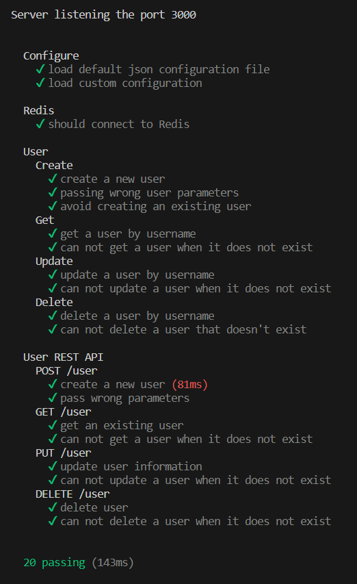

- Start application:
```
npm start
```
It is possible to check all CRUD functionalities with [Postman](https://www.postman.com)

## Checking
1. **POST** 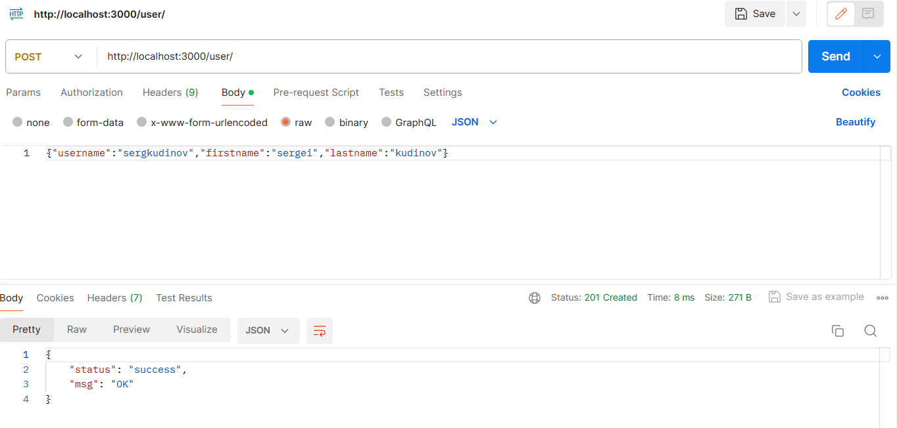
2. **PUT** 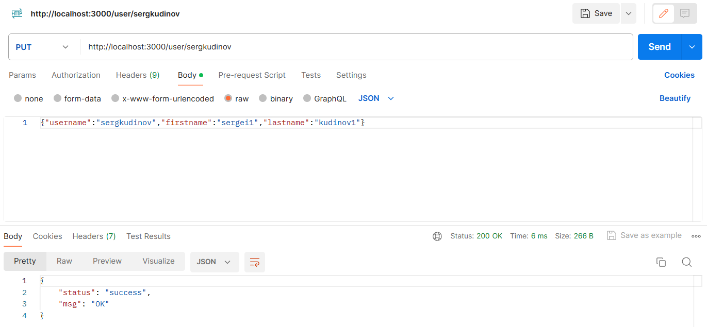
3. **DELETE** 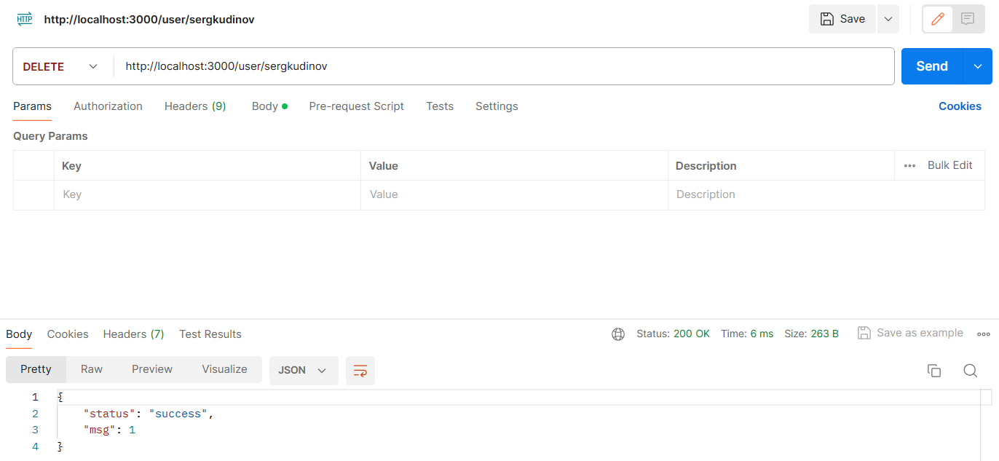

# 2. CI/CD
Configure and apply CI/CD pipeline 
## GitHub Actions
- Continuous Integration has been setup with **GitHub Actions**
It was necessary to create the workflow into [Github-Actions](https://github.com/GAidaraliev/DevOps-project/actions) which deploys and tests our web-app. The code of the workflow `nodejs.yml` is presented [here](https://github.com/GAidaraliev/DevOps-project/tree/main/.github/workflows) 

## The result of test
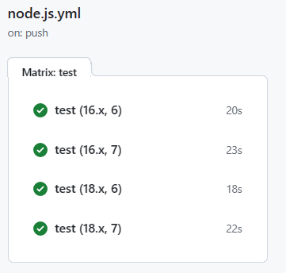

## Azure
- Continuous Deployment has been setup with Microsoft Azure

## The result of Azure deployment

# 3. Infrastructure as Code
**Before starting**
1. Install Vagrant: - https://www.vagrantup.com/downloads.html.

**Next steps**
Run the command
````
vagrant up
````
It will initialize the VM using Vagrant configuration [file](https://github.com/GAidaraliev/DevOps-project/blob/main/iac/Vagrantfile)

## VirtualBox
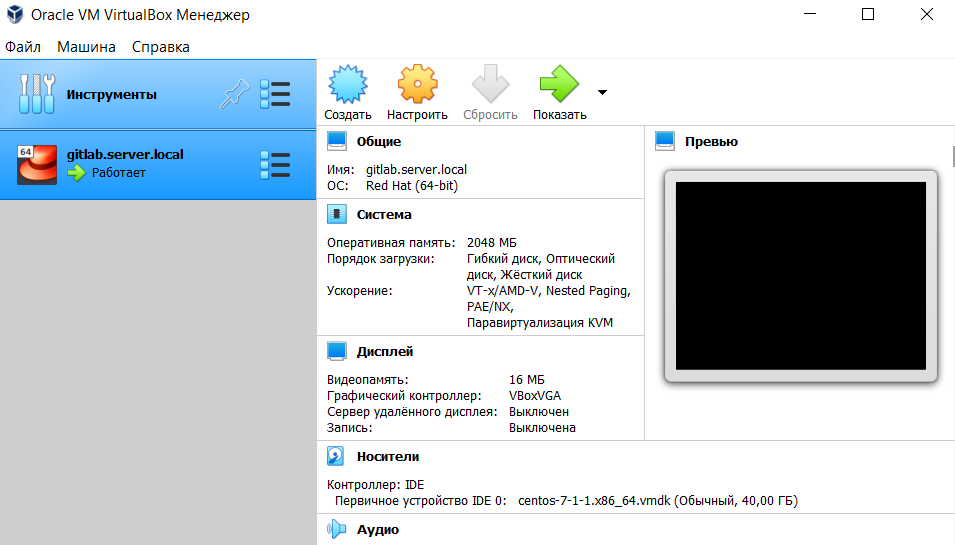

After that using Ansible [playbooks](https://github.com/GAidaraliev/DevOps-project/tree/main/iac/playbooks) we provision the VM with tools that allows us to deploy the web-app and check its functionality.

## Results of code exectution
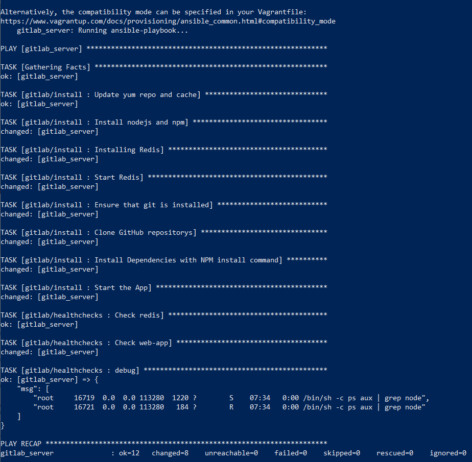

# 4. Docker image of the application

* Navigate to the `../DEVOPS-PROJECT/user-api` directory and run the command
````
docker build -t devops-project-webservice .
````
The image will be created using a [Dockerfile](https://github.com/GAidaraliev/DevOps-project/blob/main/user-api/Dockerfile)

* Check if your Docker container appears in the local Docker images

## Checking
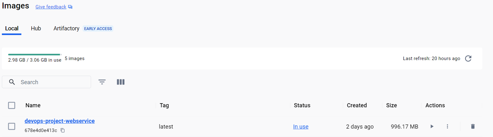

However, it must be said that it is impossible to push the image to Docker Hub for my region but **I totally understand how to do it.**

## Denial of access attempts
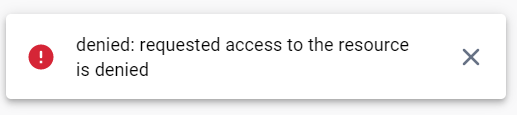

# 5. Container orchestration using Docker Compose

The web-app can be started using [docker-compose.yml](https://github.com/GAidaraliev/DevOps-project/blob/main/docker-compose.yml) file
* Navigate to the `../DEVOPS-PROJECT` directory and run the command
````
docker-compose up
````
## Result of code execution
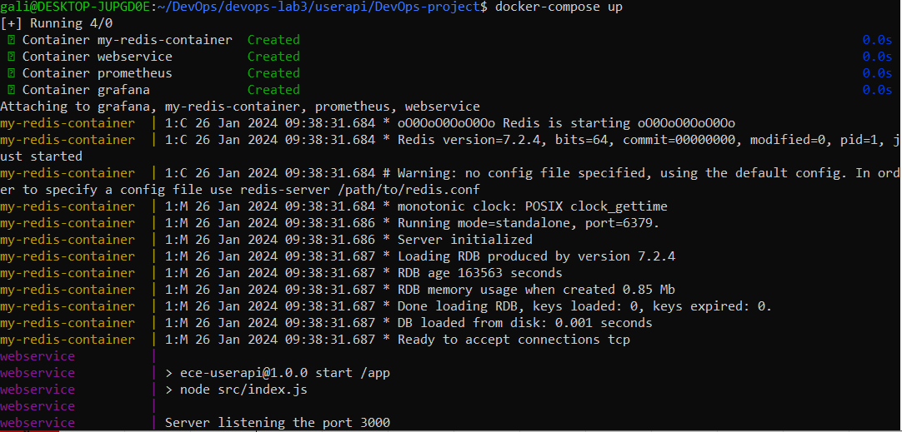

* Check the functional correctness by sending a POST request with the following command:
````
curl --header "Content-Type: application/json" \
  --request POST \
  --data '{"username":"sergkudinov","firstname":"sergei","lastname":"kudinov"}' \
  http://localhost:3000/user
````
## Checking
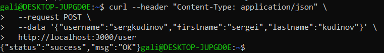

* You can also check the list of running containers using `docker ps` command

# 6. Docker orchestration using Kubernetes
To begin Kubernetes, install [**minikube**](https://kubernetes.io/fr/docs/tasks/tools/install-minikube/). Then start minikube with the command `minikube start`

As I said before I don't have access to Docker Hub that's why I use my local docker images with minikube. 
I used the method which provides a straightforward approach to push local docker images seamlessly into Minikube's in-cluster docker daemon

## Instructions
**Step 1:** Setting up the shell environmental variables
````
eval $(minikube docker-env)
````
**Step 2:** Building the docker image locally
````
docker build -t devops-project-webservice .
````
**Step 3:** Switch back to the local docker daemon
````
eval $(minikube docker-env -u)
````

## Deploy an app using Persistent Volume and Persistent Volume Claim
* Navigate to the `../DEVOPS-PROJECT/k8s` directory and run the following command
````
kubectl apply -f nodejs-deployment.yaml
kubectl apply -f nodejs-service.yaml
kubectl apply -f redis-deployment-pvc.yaml
kubectl apply -f redis-service.yaml
kubectl apply -f pvc.yaml
kubectl apply -f pv.yaml
````
* Connect dashboard to track the status of processes
````
minikube dashboard
````
### Dashboard
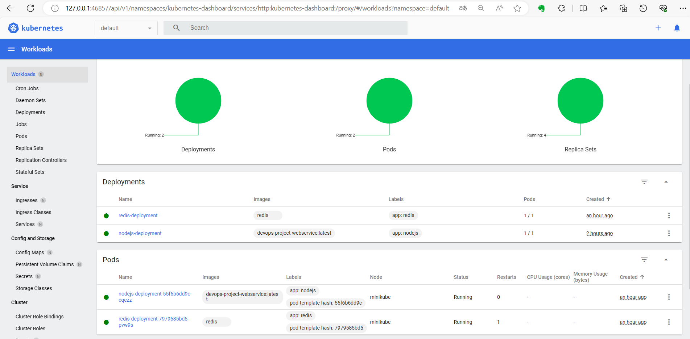

* Open nodejs-service in default browser
````
minikube service nodejs-service
````
### URL of web-service
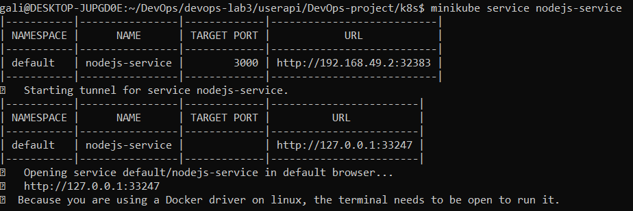

* Check the functional correctness by sending a POST request with the following command:
**`localhost:3000` should be replaced with the aforecited URL**
````
curl --header "Content-Type: application/json" \
  --request POST \
  --data '{"username":"sergkudinov","firstname":"sergei","lastname":"kudinov"}' \
  http://localhost:3000/user
````


